# Entity Relationship Diagram - Billing System

## Complete ER Diagram

```mermaid
erDiagram
    %% Master Data Entities
    Customer ||--o{ PurchaseOrder : "has"
    Customer ||--o{ SalesOrder : "has"
    GoodsType ||--o{ RawMaterial : "categorizes"
    GoodsType ||--o{ ReadyItem : "categorizes"
    GoodsType ||--o{ PurchaseItem : "has"
    GoodsType ||--o{ SalesItem : "has"
    
    %% Raw Material & Ready Item Master Data
    RawMaterial ||--o{ RawMaterialStock : "tracks"
    RawMaterial ||--o{ ProductionRecipe : "used_in"
    RawMaterial ||--o{ MaterialConsumption : "consumed"
    RawMaterial ||--o{ Proposition : "monitored"
    
    ReadyItem ||--o{ Production : "produced"
    ReadyItem ||--o{ ProductionRecipe : "requires"
    ReadyItem ||--o{ ReadyItemStock : "tracks"
    ReadyItem ||--o{ MaterialConsumption : "produces"
    ReadyItem ||--o{ Proposition : "monitored"
    ReadyItem ||--o{ SalesItem : "sold_as"
    
    %% Order Entities
    PurchaseOrder ||--o{ PurchaseItem : "contains"
    SalesOrder ||--o{ SalesItem : "contains"
    
    %% Production Entities
    Production ||--o{ MaterialConsumption : "generates"
    
    %% HR Entities
    Employee ||--o{ Attendance : "has"
    Employee ||--o{ Salary : "receives"
    Employee ||--o{ Tenure : "has"
    Employee ||--o{ Kharcha : "has"
    
    %% Base Fields (inherited by all entities)
    BaseModel {
        Long id PK
        LocalDateTime createdAt
        LocalDateTime updatedAt
    }
    
    %% Master Data
    Customer {
        Long id PK
        String name
        String contact
        String address
    }
    
    GoodsType {
        Long id PK
        String name
        Boolean isDeleted
    }
    
    RawMaterial {
        Long id PK
        String name
        String code UK
        String unit
        String description
        Long goodsTypeId FK
    }
    
    ReadyItem {
        Long id PK
        String name
        String code UK
        String unit
        String description
        Long goodsTypeId FK
        String qualityImpact
        String costImpact
        BigDecimal extraQuantityUsed
        BigDecimal lessQuantityUsed
        BigDecimal percentageDeviation
        LocalDateTime lastPropositionCheck
    }
    
    %% Order Entities
    PurchaseOrder {
        Long id PK
        Long customerId FK
        LocalDate orderDate
        BigDecimal totalAmount
        BigDecimal paidAmount
        BigDecimal balancePayment
        String paymentStatus
        String remarks
        LocalDateTime deletedAt
    }
    
    PurchaseItem {
        Long id PK
        Long purchaseOrderId FK
        Long goodsTypeId FK
        BigDecimal quantity
        BigDecimal unitPrice
        BigDecimal totalPrice
        BigDecimal rate
        BigDecimal report
        String remarks
        LocalDateTime deletedAt
        BigDecimal netQuantity
        BigDecimal fringeCost
    }
    
    SalesOrder {
        Long id PK
        Long customerId FK
        LocalDate orderDate
        BigDecimal totalAmount
        BigDecimal paidAmount
        BigDecimal balancePayment
        String paymentStatus
        String remarks
        LocalDateTime deletedAt
    }
    
    SalesItem {
        Long id PK
        Long salesOrderId FK
        Long readyItemId FK
        Long goodsTypeId FK
        String quality
        BigDecimal quantity
        BigDecimal unitPrice
        BigDecimal totalPrice
        BigDecimal rate
        BigDecimal report
        String remarks
        LocalDateTime deletedAt
    }
    
    %% Production Entities
    Production {
        Long id PK
        Long readyItemId FK
        String quality
        BigDecimal quantityProduced
        LocalDate productionDate
        String batchNumber
        String remarks
    }
    
    ProductionRecipe {
        Long id PK
        Long readyItemId FK
        Long rawMaterialId FK
        String quality
        BigDecimal quantityRequired
        String unit
    }
    
    MaterialConsumption {
        Long id PK
        Long rawMaterialId FK
        Long readyItemId FK
        BigDecimal quantity
        String consumptionType
        Long productionBatchId
        LocalDate date
        String remarks
    }
    
    %% Stock Entities
    RawMaterialStock {
        Long id PK
        Long rawMaterialId FK
        LocalDate stockDate
        BigDecimal openingStock
        BigDecimal closingStock
        BigDecimal quantityAdded
        BigDecimal quantityConsumed
        String unit
        String remarks
    }
    
    ReadyItemStock {
        Long id PK
        Long readyItemId FK
        LocalDate stockDate
        String quality
        BigDecimal openingStock
        BigDecimal closingStock
        BigDecimal quantityProduced
        BigDecimal quantitySold
        String unit
        String remarks
    }
    
    %% Quality Monitoring
    Proposition {
        Long id PK
        Long readyItemId FK
        Long rawMaterialId FK
        BigDecimal expectedPercentage
    }
    
    %% HR Entities
    Employee {
        Long id PK
        String name
        String contact
        String address
        Boolean isActive
    }
    
    Attendance {
        Long id PK
        Long employeeId FK
        LocalDate date
        String status
        String remarks
    }
    
    Salary {
        Long id PK
        Long employeeId FK
        LocalDate salaryDate
        BigDecimal amount
        String remarks
    }
    
    Tenure {
        Long id PK
        Long employeeId FK
        LocalDate startDate
        LocalDate endDate
        String status
    }
    
    Kharcha {
        Long id PK
        Long employeeId FK
        LocalDate date
        BigDecimal amount
        String description
    }
    
    Cash {
        Long id PK
        LocalDate date
        BigDecimal amount
        String type
        String description
    }
    
    User {
        Long id PK
        String pin
        String roles
    }
```

## Key Relationships

### 1. **Order Management**
- **Customer** → **PurchaseOrder** (1:N) - One customer can have multiple purchase orders
- **Customer** → **SalesOrder** (1:N) - One customer can have multiple sales orders
- **PurchaseOrder** → **PurchaseItem** (1:N) - One purchase order contains multiple items
- **SalesOrder** → **SalesItem** (1:N) - One sales order contains multiple items

### 2. **Master Data**
- **GoodsType** → **RawMaterial** (1:N) - Categorizes raw materials
- **GoodsType** → **ReadyItem** (1:N) - Categorizes ready items
- **GoodsType** → **PurchaseItem** (1:N) - Links purchase items to types
- **GoodsType** → **SalesItem** (1:N) - Links sales items to types

### 3. **Production Flow**
- **ReadyItem** → **Production** (1:N) - Tracks production batches
- **ReadyItem** → **ProductionRecipe** (1:N) - Defines recipes per quality
- **RawMaterial** → **ProductionRecipe** (1:N) - Materials used in recipes
- **Production** → **MaterialConsumption** (1:N) - Tracks material usage
- **RawMaterial** → **MaterialConsumption** (1:N) - Records consumption

### 4. **Stock Management**
- **RawMaterial** → **RawMaterialStock** (1:N) - Daily stock tracking
- **ReadyItem** → **ReadyItemStock** (1:N) - Daily stock tracking by quality
- **SalesItem** → **ReadyItem** (N:1) - Links sales to ready items with quality

### 5. **Quality Monitoring**
- **ReadyItem** → **Proposition** (1:N) - Expected consumption percentages
- **RawMaterial** → **Proposition** (1:N) - Monitored materials
- **Proposition** tracks expected vs actual consumption for quality/cost impact

### 6. **HR Management**
- **Employee** → **Attendance** (1:N) - Daily attendance records
- **Employee** → **Salary** (1:N) - Salary payments
- **Employee** → **Tenure** (1:N) - Employment periods
- **Employee** → **Kharcha** (1:N) - Expenses

## Unique Constraints

1. **RawMaterial**: `code` (unique)
2. **ReadyItem**: `code` (unique)
3. **ProductionRecipe**: `(ready_item_id, raw_material_id, quality)` (unique)
4. **Proposition**: `(ready_item_id, raw_material_id)` (unique)
5. **ReadyItemStock**: `(ready_item_id, stock_date, quality)` (unique)

## Important Notes

- All entities extend **BaseModel** which provides `id`, `createdAt`, `updatedAt`
- **ReadyItemStock** tracks stock separately by quality (M1, M2, M3)
- **SalesItem** now directly links to **ReadyItem** with quality specification
- **ProductionRecipe** defines material requirements per quality level
- **Proposition** monitors material consumption percentages for quality/cost impact
- Soft delete is implemented using `deletedAt` field in orders and items

